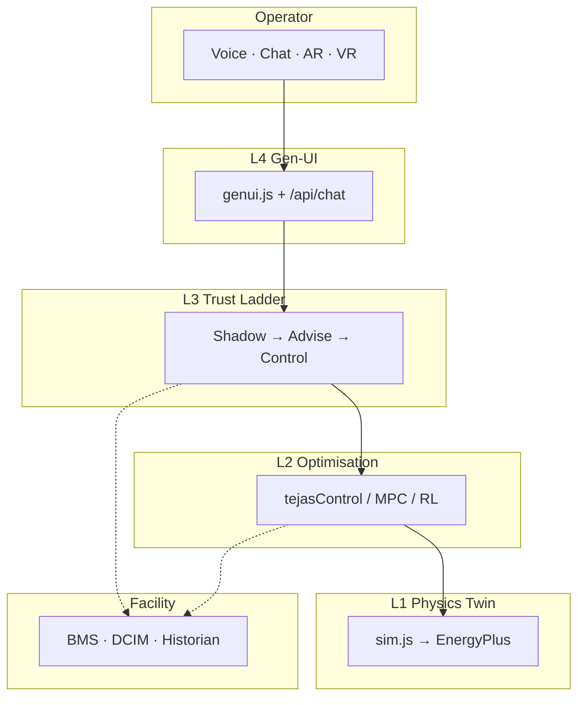

# Tejas AI

**The autonomous brain for cooling & energy** — a physics-calibrated digital twin platform that predicts heat, optimises every joule, and lets operators run critical facilities by voice. Built in India. On-prem by default.

```bash
cd tejas-twin && ./run.sh
# → https://localhost:7878
```

---

## Table of contents

1. [Overview](#overview)
2. [The problem](#the-problem)
3. [The solution](#the-solution)
4. [Product demo](#product-demo)
5. [How it works](#how-it-works)
6. [Technology stack](#technology-stack)
7. [Features](#features)
8. [Trust ladder](#trust-ladder)
9. [Quick start](#quick-start)
10. [Repository](#repository)
11. [Documentation](#documentation)
12. [Target verticals](#target-verticals)
13. [Business model](#business-model)
14. [Why Tejas wins](#why-tejas-wins)

---

## Overview

**Tejas AI** replaces decades-old rule-based building logic with a **self-learning control agent** trained on a **physics-accurate digital twin** of your facility. It reads leading indicators — rack power, weather forecast, thermal mass — and acts *before* temperatures spike, not after. The result: **20–40% less cooling energy** for the same safety envelope, with every decision explained in plain language.

The platform covers the full lifecycle: **twin → shadow → advisory → supervised → autonomous control**, so conservative operators never hand the keys to unproven AI. Technicians close the loop in **Field AR** — diagnose **GPU-16**, fix the part, watch the rack turn **red → blue** on the twin.

**तेजस् (Tejas)** — Sanskrit for radiance, sharpness, fire-energy. Also India's indigenous fighter jet. A fitting name for an AI built to tame heat, made in India.

> *"What did your building know last night that you didn't?"*

---

## The problem

Cooling is one of the largest and fastest-growing energy drains on earth — and almost all of it runs on **dumb, fixed logic** set once at install and never tuned.

| Reality | Impact |
|---|---|
| Data centers spend **30–40%** of total power on cooling | PUE stuck at 1.4–1.6 while AI racks push 14+ kW |
| Cold chain holds 2–8°C by **over-cooling** "just to be safe" | Refrigeration = **15–25%** of operating cost |
| India's post-harvest loss exceeds **₹92,000 Cr/year** | Spoilage from missing cold-chain optimisation |
| Operators are **not data scientists** | They can't tune MPC; they barely navigate the BMS |
| **45°C Indian summers** are the new normal | Rule-based systems panic, burn power, and still trip racks |

**Why this is acute in India:**

| Factor | Effect |
|---|---|
| Extreme heat | 40–48°C summers — cooling runs harder every year |
| Grid stress | Every wasted kWh hurts twice (cost + blackout risk) |
| Water scarcity | Optimisation cuts water (WUE) too |
| Exploding demand | DC boom, cold-chain expansion, commercial real estate surge |
| No mid-market player | Phaidra chases hyperscalers; thousands of facilities have **no optimiser** |

---

## The solution

Tejas replaces "if temp > X, turn on chiller" with a **learning agent** that:

1. **Predicts** — feed-forward from rack power, weather, thermal lag (act in &lt;10s, not after inlet spike)
2. **Optimises** — MPC/RL finds setpoints that hold the *safe* band with the *least* energy
3. **Explains** — voice, chat, vernacular; the UI builds itself from what the operator asks
4. **Maintains** — physics residuals flag faults months early (GPU-16: +3.4°C unexplained drift)
5. **Proves first** — trains on the twin, shadows real BMS read-only, then climbs the trust ladder

```
  PHASE 0 · TWIN          PHASE 1 · SHADOW         PHASE 2 · ADVISE        PHASE 3 · CONTROL
  ─────────────────       ──────────────────       ────────────────        ─────────────────
  Physics twin + train    Read-only on real BMS    AI recommends           Closed-loop inside
  in simulation.          Log would-do vs reality.  setpoints; human        hard safety envelope.
  Zero hardware.          Prove savings on YOUR     applies. Builds trust.  Instant revert.
                          numbers. Zero risk.
```

---

## Product demo

| Asset | Link |
|---|---|
| **Video walkthrough** | [Watch on SharePoint](https://accuconsult-my.sharepoint.com/:v:/g/personal/harsh_zenalyst_ai/IQCCDlXCZ5lwR5V-T7A_N7cMAT15xtCeoMB5dCppqR4f2d8?e=lg9S4D&nav=eyJyZWZlcnJhbEluZm8iOnsicmVmZXJyYWxBcHAiOiJTdHJlYW1XZWJBcHAiLCJyZWZlcnJhbFZpZXciOiJTaGFyZURpYWxvZy1MaW5rIiwicmVmZXJyYWxBcHBQbGF0Zm9ybSI6IldlYiIsInJlZmVycmFsTW9kZSI6InZpZXcifX0%3D) |
| **Pitch deck** | [View on Canva](https://canva.link/348k4b76wzcfxen) |
| **Live prototype** | `cd tejas-twin && ./run.sh` → https://localhost:7878 |

### 90-second live demo

1. Open `/datacenter` — **Autonomous Control** card + **PUE ~1.3 vs ~1.5**
2. Weather → **47°C** — baseline panics; AI holds savings gap
3. *"How much electricity are we using?"* — answers from live twin state
4. *"Is any machine going down?"* → **GPU-16** pulses red, work order + parts + email draft
5. *"Project savings across 50 sites"* — fleet panel
6. Press **`T`** or tap 🧠 — voice works (English / Hindi)

Full script: [`docs/demo.md`](./docs/demo.md)

---

## How it works

### Four-layer architecture

```
┌──────────────────────────────────────────────────────────────────────┐
│  L4  GENERATIVE UI + VOICE   talk → dashboard builds → actions on twin │
├──────────────────────────────────────────────────────────────────────┤
│  L3  TRUST LADDER            twin → shadow → advise → control          │
├──────────────────────────────────────────────────────────────────────┤
│  L2  OPTIMISATION ENGINE     MPC + RL · predict + minimise energy      │
├──────────────────────────────────────────────────────────────────────┤
│  L1  DIGITAL TWIN            physics · sim.js → EnergyPlus/Sinergym      │
└──────────────────────────────────────────────────────────────────────┘
```

### Scalable spatial hierarchy

```
Fleet (N sites) → Campus → Hall → Rack → Component
```

Prototype runs as one laptop. Production scales to **edge cluster** (Gateway + Twin Engine + Optimiser + Safety Supervisor + Ollama) with optional **fleet control plane** for multi-site M&V.

### Physics core

```
ΔT_return = Q_IT / (UA_air · fanFrac)              — air-side heat balance
T_inlet   = T_supply + recirc(T_hot) + hotspot + faultRise
COP       = f(T_ambient, T_CHW)                     — chiller degrades in heat
P_fan     ∝ fanFrac³                                — affinity law
PUE       = P_total / P_IT
```

See [`docs/ARCHITECTURE.md`](./docs/ARCHITECTURE.md) for governing equations, fleet topology, and API reference.



---

## Technology stack

| Layer | Prototype (`tejas-twin/`) | Production target |
|---|---|---|
| **L1 · Digital twin** | `sim.js` — lumped thermal physics: recirculation, chiller COP, fan³ law, ASHRAE A1 | **EnergyPlus** + **Sinergym**; CFD-informed recirculation |
| **L2 · Control brain** | `tejasControl()` grid search over supply temp + fan speed | **MPC** (day-one) + **RL** (Stable-Baselines3) trained in twin |
| **L3 · Safe deploy** | Trust-ladder UI + in-optimizer hard constraints | **Safety Supervisor** service; shadow → advisory → autonomous |
| **L4 · Operator UX** | Gen-UI panels + Web Speech + `/api/chat` | **Ollama** tool-calling; Whisper STT / Piper TTS |
| **3D / XR** | Three.js r160 (vendored), WebGL, Field AR, VR | LiDAR alignment, photogrammetry ingest |
| **Backend** | Python 3.8+ stdlib (`server.py`), auto TLS | Edge gateway; BACnet, Modbus, OPC-UA, Redfish |
| **AI inference** | OpenAI (optional) → Ollama → `localParse()` offline | On-prem default; air-gapped bundles |
| **Ingestion** | 6-step brownfield wizard + AI clarify | Historian export, DCIM import, calibration pipeline |

**Zero npm. Zero pip.** One command runs the full stack on a laptop.

### AI brain (automatic fallback)

1. **OpenAI** — if `OPENAI_API_KEY` set  
2. **Ollama** — if `localhost:11434` reachable  
3. **Built-in parser** — always works offline  

---

## Features

| Feature | Route | Status |
|---|---|---|
| Admin command centre | `/` | Live |
| Flagship 3D data-center twin | `/datacenter` | Live |
| Autonomous cooling vs baseline BMS | `/datacenter` | Live |
| Predictive maintenance (GPU-16) | `/datacenter` | Live |
| AI chat + voice (`T` key) | `/datacenter` | Live |
| Gen-UI panels (savings, PUE, fleet…) | `/datacenter` | Live |
| VR walkthrough + voice assistant | `/vr` | Live |
| Field AR fix + build-from-camera | `/ar` | Live |
| Brownfield ingestion wizard | `/ingest` | Live |
| Twin Studio (drag/drop + AI layout) | `/build` | Live |
| Phone scan → twin | `/scan` | Live |
| Factory / plant twins (4 types) | `/factory` | Live |
| Rack inspect red → blue | modules built | UI wiring next |
| Glass analytics console | `/twin` | Live |

Full matrix: [`docs/PRODUCT.md`](./docs/PRODUCT.md)

---

## Trust ladder

```
TWIN → SHADOW (read-only) → ADVISORY → SUPERVISED → AUTONOMOUS
```

| Phase | Customer risk | Deliverable |
|---|---|---|
| **Twin** | None | Physics model + AI trained in simulation |
| **Shadow** | None | 30-day report: would-do vs your BMS |
| **Advisory** | Low | Live setpoint recommendations |
| **Supervised** | Medium | AI writes; human confirms each change |
| **Autonomous** | Managed | Closed-loop inside hard envelope + instant revert |

**Rule:** Never skip a rung. Never promise autonomous on an uncalibrated twin.

---

## Quick start

```bash
git clone <repo-url>
cd minmo/tejas-twin
export OPENAI_API_KEY=sk-...   # optional
./run.sh
# → https://localhost:7878
```

### Routes

| URL | What you get |
|---|---|
| `/` | Admin — all twins, create flows |
| `/datacenter` | **Flagship** — 3D AI hall, live physics, chat actions |
| `/twin` | Glass console — Analytics · Config · Simulations |
| `/factory` | Factory / nuclear / geothermal / solar twins |
| `/build` | Twin Studio — design any facility |
| `/ingest` | Enterprise brownfield onboarding |
| `/scan` | Phone video → register twin |
| `/ar` | Field AR — fix GPU-16 or build from camera |
| `/vr` | First-person walk + AI voice assistant |

### Phone access

Same Wi-Fi → `https://<LAN-IP>:7878` (accept self-signed cert for camera/AR).

App guide: [`tejas-twin/README.md`](./tejas-twin/README.md)

---

## Repository

```
minmo/
├── README.md                    ← you are here
├── docs/
│   ├── README.md                ← 3-tier doc index
│   ├── ARCHITECTURE.md          ← physics, fleet scale, APIs
│   ├── PRODUCT.md               ← features, roadmap, status
│   ├── project.md               ← strategy, GTM, pricing
│   ├── demo.md                  ← demo scripts
│   ├── story.md                 ← sales narrative
│   └── pitch/                   ← decks, 60s script, one-pager
└── tejas-twin/                  ← runnable application
    ├── run.sh                   ← one-command launcher
    ├── server.py                ← APIs, AI brain, twin registry
    ├── ingestion.md             ← enterprise ingestion spec
    └── public/
        ├── sim.js               ← thermal physics engine
        ├── app.js               ← data-center orchestration
        ├── twin3d.js            ← Three.js 3D hall
        ├── genui.js             ← chat client
        ├── vr.js · ar.js        ← XR experiences
        └── ...
```

---

## Documentation

**Full map:** [`docs/README.md`](./docs/README.md)

| Tier | When to read | Docs |
|---|---|---|
| **1 · Start** | Everyone, judges, first visit | [ARCHITECTURE](./docs/ARCHITECTURE.md) · [PRODUCT](./docs/PRODUCT.md) · [demo](./docs/demo.md) |
| **2 · Sell** | Investors, customers, pitch prep | [project](./docs/project.md) · [story](./docs/story.md) · [pitch/](./docs/pitch/) |
| **3 · Specs** | Engineering deep-dive | [ingestion](./tejas-twin/ingestion.md) · [rack inspect](./tejas-twin/ARCHITECTURE-rack-inspect-fix.md) |

---

## Target verticals

| Vertical | Hook | Demo anchor |
|---|---|---|
| **Data centers** | PUE 1.3 vs 1.5 at 47°C; GPU-16 PM before outage | Chennai OMR corridor |
| **Cold chain** | Hold 2–8°C at warmest safe point; −15–25% refrigeration | National spoilage crisis |
| **Edge / mid-size DCs** | India's DC boom; Phaidra ignores this segment | Fleet projection panel |
| **Commercial buildings** | HVAC = 40–50% of energy; advisory-mode entry | 47°C heat-wave drill |
| **Smart factories** | PRESS-7 vibration early warning | Renesas-class outage pattern |
| **Geothermal / plants** | SEP-2 separator drift monitoring | VR plant walkthrough |

---

## Business model

| Model | Description |
|---|---|
| **Savings-share (20–40%)** | Customer pays only from verified energy savings. *Primary.* |
| **SaaS per facility** | Predictable recurring once trust is established |
| **Twin-build engagement** | Paid on-ramp that produces the ROI case for control |

Land one facility in a chain → expand across all sites. The twin and playbook replicate.

---

## Why Tejas wins

| vs | They | Tejas |
|---|---|---|
| **BMS status quo** | Reactive fixed rules | Predict + learn + explain |
| **Phaidra / foreign** | Hyperscaler AI factories, cloud | Mid-market India, on-prem, savings-share |
| **Schneider / Vertiv** | Hardware + dashboards | AI control layer, no rip-and-replace |
| **Build in-house** | No twin or simulation infra | Off-the-shelf brain + shadow proof |

**Moat:** calibrated twin + safe control policy + per-site operational data + trust to run critical cooling + India-tuned voice.

---

## The bet

> The world proved AI can run cooling far better than humans — but the players doing it aim at a handful of hyperscale AI factories. India has thousands of cold stores, buildings, hospitals, and data centers cooking in 45°C heat on dumb 1990s logic. **Tejas AI** is the cooling brain for all of them: trained on a physics twin so we need no hardware to start, deployed safely watch→advise→control, run fully on-prem, and operated by talking to it. **We don't sell a dashboard. We sell rupees off the power bill.**

---

*तेजस् · Built in India · On-prem · Savings-share*

*[Video demo](https://accuconsult-my.sharepoint.com/:v:/g/personal/harsh_zenalyst_ai/IQCCDlXCZ5lwR5V-T7A_N7cMAT15xtCeoMB5dCppqR4f2d8?e=lg9S4D) · [Pitch deck](https://canva.link/348k4b76wzcfxen)*