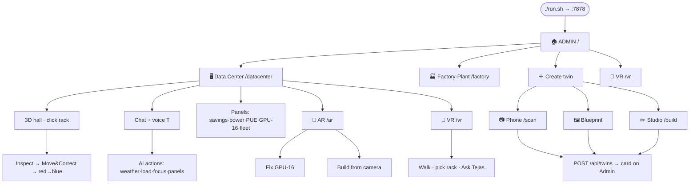

# Tejas AI

**The autonomous brain for cooling & energy** — digital twin platform, on-prem, built in India.

---

## Overview

**Tejas AI** is a self-learning agent that runs a facility's cooling at peak efficiency — **20–40% less energy** for the same safety band. It trains on a **physics-based digital twin**, deploys without ripping out existing BMS hardware, and is operated by **voice and chat** (no dashboard training).

**Problem:** Cooling eats 30–40% of data-center power and similar shares in cold chain and buildings. Almost all of it runs on fixed rule-based logic that reacts *after* heat builds up. Indian facilities face 45°C summers, costly power, and no mid-market alternative to hyperscaler-only players like Phaidra.

**Solution:** Predict heat from rack power + weather + thermal mass → optimise setpoints inside a hard safety envelope → climb a trust ladder (twin → shadow → advise → control) before touching live hardware.

---

## Product demo

| Asset | Link |
|---|---|
| **Video** | [SharePoint walkthrough](https://accuconsult-my.sharepoint.com/:v:/g/personal/harsh_zenalyst_ai/IQCCDlXCZ5lwR5V-T7A_N7cMAT15xtCeoMB5dCppqR4f2d8?e=lg9S4D&nav=eyJyZWZlcnJhbEluZm8iOnsicmVmZXJyYWxBcHAiOiJTdHJlYW1XZWJBcHAiLCJyZWZlcnJhbFZpZXciOiJTaGFyZURpYWxvZy1MaW5rIiwicmVmZXJyYWxBcHBQbGF0Zm9ybSI6IldlYiIsInJlZmVycmFsTW9kZSI6InZpZXcifX0%3D) |
| **Pitch deck** | [Canva presentation](https://canva.link/348k4b76wzcfxen) |
| **Live app** | `cd tejas-twin && ./run.sh` → https://localhost:7878 |

**Quick demo:** `/datacenter` → weather **47°C** → *"is any machine going down?"* → **GPU-16**

---

## Complete user flow

**Every click, every feature — flow-charts for diagrams:** [**docs/FLOW.md**](./docs/FLOW.md)



---

## Technology stack

| Layer | Prototype (`tejas-twin/`) | Production |
|---|---|---|
| **L1 Twin** | `sim.js` — air-side ΔT, recirculation, chiller COP, fan³ law | EnergyPlus + Sinergym |
| **L2 Control** | `tejasControl()` grid search | MPC + RL (trained in twin) |
| **L3 Deploy** | Trust-ladder UI | Shadow → advisory → Safety Supervisor |
| **L4 UX** | Gen-UI + `/api/chat` + voice | Ollama on-prem, vernacular STT/TTS |
| **Backend** | Python stdlib `server.py`, no pip/npm | Edge gateway, BACnet/Modbus/Redfish |
| **3D / XR** | Three.js, AR, VR | Same surfaces, calibrated to site |

---

## Quick start

```bash
cd tejas-twin && ./run.sh
# → https://localhost:7878
```

| Route | What |
|---|---|
| `/` | Admin — pick or create a twin |
| `/datacenter` | Flagship 3D hall + live physics |
| `/vr` `/ar` | VR walkthrough · Field AR fix |
| `/build` | Twin Studio · `/scan` phone capture |

---

## Documentation

**Full map:** [**docs/README.md**](./docs/README.md) (3-tier index)

| Tier | Docs |
|---|---|
| **1 · Start** | [FLOW](./docs/FLOW.md) · [ARCHITECTURE](./docs/ARCHITECTURE.md) · [PRODUCT](./docs/PRODUCT.md) · [demo](./docs/demo.md) |
| **2 · Sell** | [project](./docs/project.md) · [story](./docs/story.md) · [pitch/](./docs/pitch/) |
| **3 · Specs** | [rack inspect](./tejas-twin/ARCHITECTURE-rack-inspect-fix.md) |

```
tejas/
├── README.md          ← you are here
├── docs/              ← product, arch, pitch
└── tejas-twin/        ← runnable app + tier-3 specs
```

---

*तेजस् · Built in India · On-prem · Savings-share*