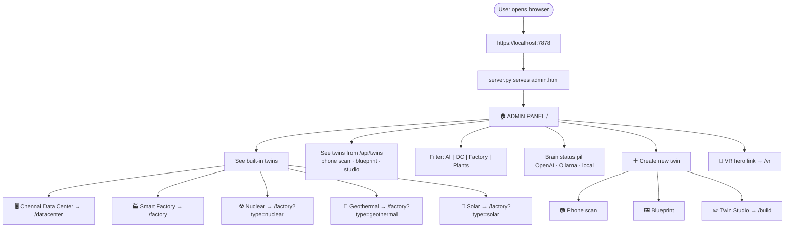
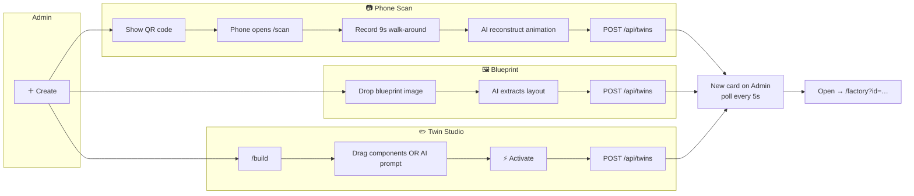
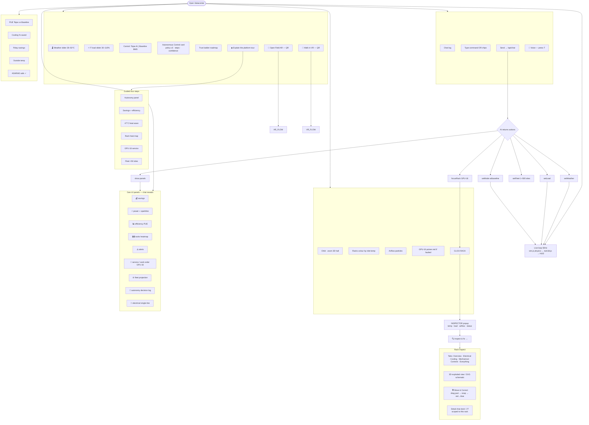
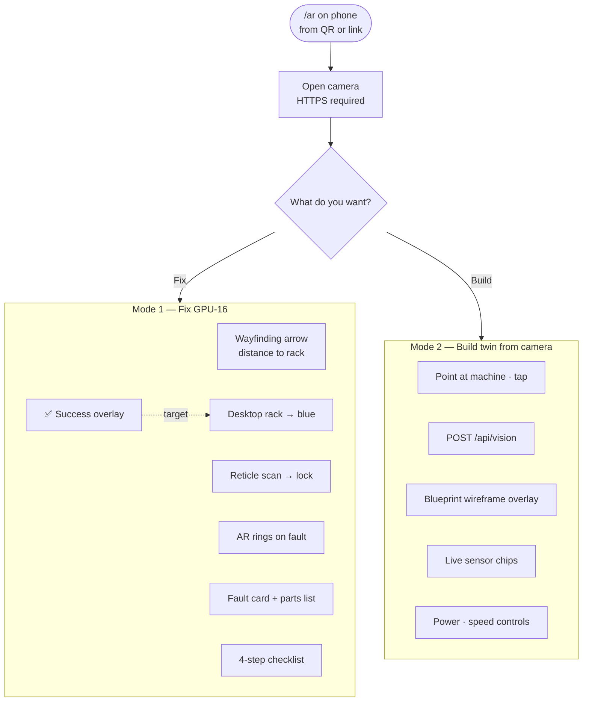
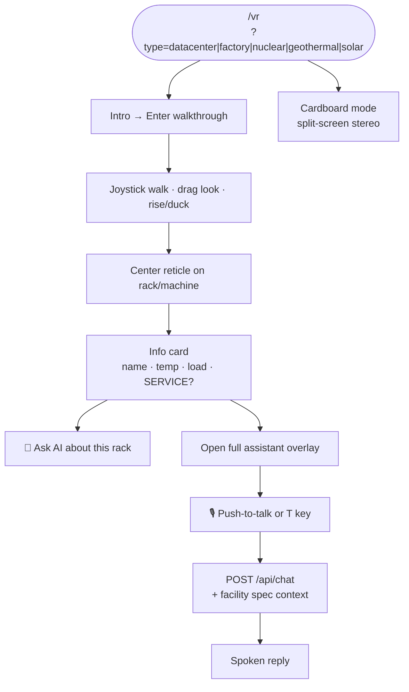
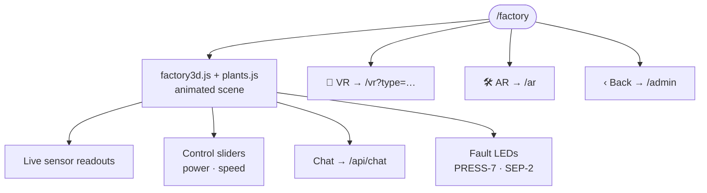
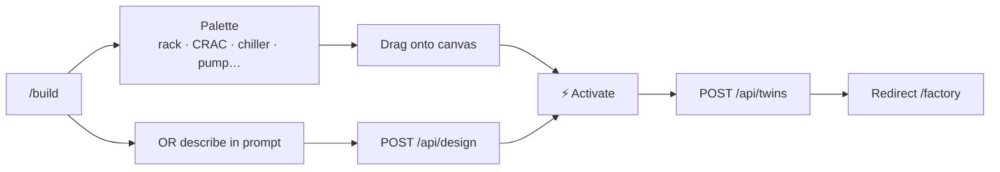
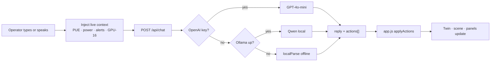
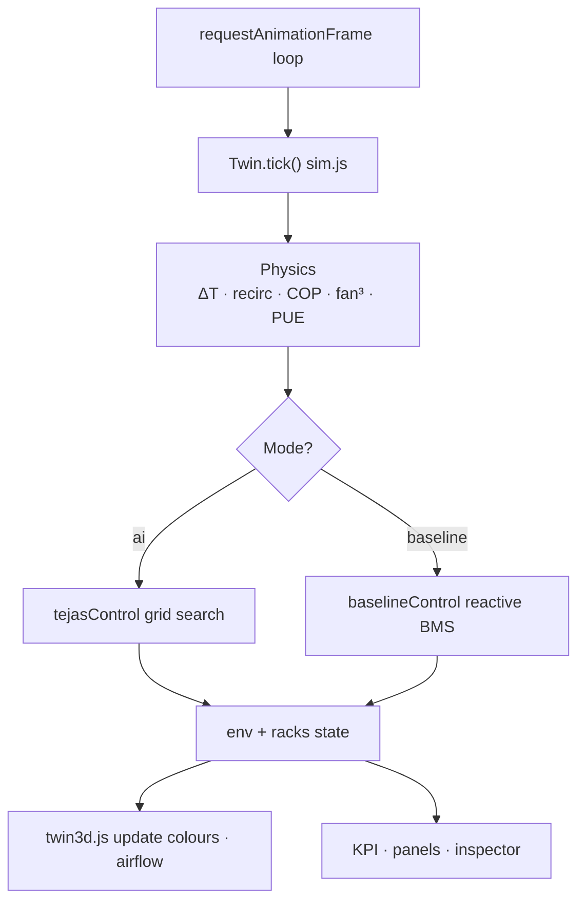

# Tejas AI — Complete User Flow

End-to-end flow from launch to every feature. **Ingestion excluded.**  
Use these diagrams in Mermaid Live Editor, draw.io, or any flow-chart tool.

**Run:** `cd tejas-twin && ./run.sh` → https://localhost:7878

---

## 1. Master flow (top → bottom)

Copy this for your main flow-chart:

```mermaid
flowchart TB
    START(["🚀 START<br/>./run.sh → localhost:7878"])

    START --> ADMIN["🏠 ADMIN PANEL<br/>/"]

    ADMIN --> FILTER["Filter twins<br/>All · Data Centers · Factories · Plants"]
    ADMIN --> HERO_VR["🥽 Walk in VR<br/>/vr"]
    ADMIN --> CREATE["＋ Create new twin"]

    ADMIN --> DC_CARD["Click: Chennai AI Data Center"]
    ADMIN --> FAC_CARD["Click: Smart Factory"]
    ADMIN --> PLANT_CARD["Click: Nuclear · Geothermal · Solar"]
    ADMIN --> USER_CARD["Click: User-created twin<br/>from scan / blueprint / studio"]

    DC_CARD --> DATACENTER["🖥️ DATA CENTER TWIN<br/>/datacenter"]
    FAC_CARD --> FACTORY["🏭 FACTORY / PLANT TWIN<br/>/factory"]
    PLANT_CARD --> FACTORY
    USER_CARD --> FACTORY

    CREATE --> C_SCAN["📷 Scan with phone"]
    CREATE --> C_BP["🖼️ Upload blueprint"]
    CREATE --> C_STUDIO["✏️ Twin Studio"]

    C_SCAN --> SCAN_PHONE["Phone: /scan<br/>9s video → AI reconstruct"]
    SCAN_PHONE --> API_TWIN["POST /api/twins"]
    API_TWIN --> ADMIN

    C_BP --> BP_BUILD["AI reads image<br/>Build twin"]
    BP_BUILD --> API_TWIN

    C_STUDIO --> BUILD["Twin Studio /build"]
    BUILD --> API_TWIN

    DATACENTER --> DC_FEATURES
    FACTORY --> FAC_FEATURES
    HERO_VR --> VR
    DATACENTER --> AR
    DATACENTER --> VR
    FACTORY --> AR
    FACTORY --> VR

    subgraph DC_FEATURES["Data Center — feature boxes"]
        direction TB
        D3D["3D Hall<br/>racks glow by temp"]
        D_ENV["Environment<br/>Weather · Load sliders"]
        D_MODE["Control mode<br/>Tejas AI ↔ Baseline"]
        D_AUTO["Autonomous card<br/>policy · confidence"]
        D_CHAT["Tejas Assistant<br/>chat + voice T"]
        D_PANELS["Gen-UI panels<br/>savings · power · PUE…"]
        D_RACK["Click rack"]
        D_TOUR["▶ Guided tour"]
        D_ARQR["📱 AR QR"]
        D_VRQR["🥽 VR QR"]
    end

    subgraph FAC_FEATURES["Factory / Plant — feature boxes"]
        direction TB
        F3D["3D scene<br/>machines animate"]
        F_SENS["Live sensors"]
        F_CTRL["Power · speed controls"]
        F_CHAT["Chat brain"]
        F_VR["VR walk link"]
        F_AR["Field AR link"]
    end

    subgraph AR["Field AR /ar"]
        direction TB
        AR_CHOICE{"Choose mode"}
        AR_FIX["🔧 Fix GPU-16<br/>navigate → lock → 4-step fix"]
        AR_BUILD["✨ Build from camera<br/>vision → blueprint overlay"]
    end

    subgraph VR["VR Walkthrough /vr"]
        direction TB
        VR_WALK["Joystick walk<br/>gyro look"]
        VR_PICK["Reticle pick rack"]
        VR_INFO["Inspect card<br/>temp · load · status"]
        VR_AI["💬 Ask Tejas<br/>push-to-talk T"]
    end

    D_RACK --> INSP["Inspector panel"]
    INSP --> DETAIL["Full inspect screen<br/>tabs · fix · chat dock"]
    DETAIL --> REDBLUE["Move & Correct<br/>red → blue"]

    D_CHAT --> BRAIN["POST /api/chat"]
    D_TOUR --> BRAIN
    VR_AI --> BRAIN
    BRAIN --> ACTIONS["Actions on twin<br/>weather · load · panels · focus rack"]
```



---

## 2. Entry → Admin (level 1)



---

## 3. Create new twin (no ingestion)



---

## 4. Data Center twin — complete feature flow

**This is the flagship path.** Everything connects from `/datacenter`.



---

## 5. Field AR flow (`/ar`)



---

## 6. VR flow (`/vr`)



---

## 7. Factory / Plant twin flow (`/factory`)



---

## 8. Twin Studio flow (`/build`)



---

## 9. AI brain flow (under every chat/voice)



---

## 10. Physics + control loop (what runs under the hood)



---

## 11. One-page linear journey (for slides)

```
START → ./run.sh
  ↓
ADMIN /  ─────────────────────────────────────────────┐
  │                                                    │
  ├─→ DATACENTER /datacenter  ← flagship              │
  │     ├─ sliders (weather · load)                     │
  │     ├─ mode (AI vs baseline)                      │
  │     ├─ chat / voice (T) → panels open             │
  │     ├─ click rack → inspect → fix → blue          │
  │     ├─ tour (6 steps)                             │
  │     └─ QR → AR or VR                              │
  │                                                    │
  ├─→ FACTORY /factory  (smart · nuclear · geo · solar)│
  │     └─ sensors · controls · VR · AR               │
  │                                                    │
  ├─→ CREATE +                                         │
  │     ├─ phone /scan → twin card                     │
  │     ├─ blueprint upload → twin card                │
  │     └─ /build studio → twin card                  │
  │                                                    │
  └─→ VR /vr  (from admin hero or any twin)            │
        └─ walk · pick · Ask Tejas                     │
                                                       │
AR /ar ← from datacenter or factory QR ────────────────┘
  ├─ fix GPU-16
  └─ build from camera
```

---

## 12. Route map (quick reference)

| Step | URL | You click / do |
|---|---|---|
| 1 | `/` | Land on Admin |
| 2a | `/datacenter` | Open data-center card |
| 2b | `/factory?type=…` | Open factory/plant card |
| 2c | `/build` | Twin Studio from create |
| 2d | `/scan` | Phone scan (from create QR) |
| 3 | `/datacenter` | Chat, sliders, click rack |
| 4 | `/ar` | Field AR from QR |
| 5 | `/vr` | VR from QR or admin |
| 6 | `/twin` | Optional glass console |

---

*No ingestion in this flow. For system architecture see [`ARCHITECTURE.md`](./ARCHITECTURE.md).*